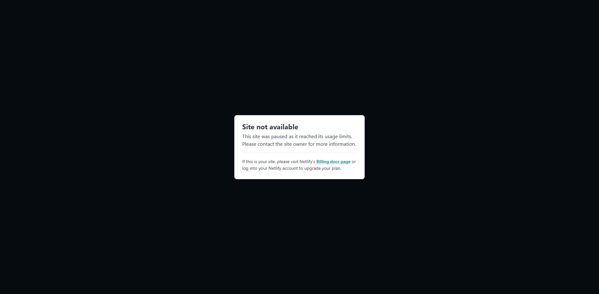

# 🌌 Solar System Explorer (Gesture Controlled)

> **Live Demo:** [Control the Solar System](https://controlsolarsystemusinghands.netlify.app/)

An immersive, interactive 3D simulation of our Solar System where you become the pilot. Using advanced hand-gesture recognition, you can travel between planets, freeze time, and manually rotate the camera—all with simple hand movements captured by your webcam.

## ✨ Features
- **3D Solar System:** Rendered beautifully using Three.js with custom shaders for sun glow and planetary surfaces, including clouds, rings, and moons.
- **Hand Gesture Control:** Powered by MediaPipe, control the explorer with 5 distinct gestures:
  - ✋ **Open Palm:** Navigate to the next planet.
  - ✊ **Closed Fist:** Freeze time (pause orbits and rotations).
  - ☝️ **Index Finger:** Swipe left/right in the air to manually rotate the camera around the current planet.
  - ✌️ **Peace Sign:** Reset the camera view and orbit.
  - 🖖 **Three Fingers:** Toggle the telemetry data HUD.
- **Dynamic Telemetry HUD:** View real-time planetary data including classification, orbital period, surface temperature, and more in a sleek, sci-fi interface.

## 🛠️ Tech Stack
- **Frontend:** HTML5, Tailwind CSS
- **3D Rendering:** [Three.js](https://threejs.org/)
- **Computer Vision:** [MediaPipe Hands](https://developers.google.com/mediapipe/solutions/vision/hand_landmarker)
- **Deployment:** Netlify

## 🚀 Getting Started

To run this project locally:

1. Clone the repository:
   ```bash
   git clone https://github.com/amanamarjit243222/solar-system-using-hand-gesture.git
   ```
2. Navigate to the project directory:
   ```bash
   cd solar-system-using-hand-gesture
   ```
3. Run a local server (required for webcam access and loading local assets):
   ```bash
   # If you use Node/npx
   npx serve ./
   
   # If you use Python 3
   python -m http.server 8000
   ```
4. Open `http://localhost:8000` in your web browser. 
5. Allow webcam permissions when prompted to enable gesture controls.

## 📸 Screenshots




## 🤝 Contributing
Contributions, issues, and feature requests are welcome!

## 📄 License
This project is open-source.
